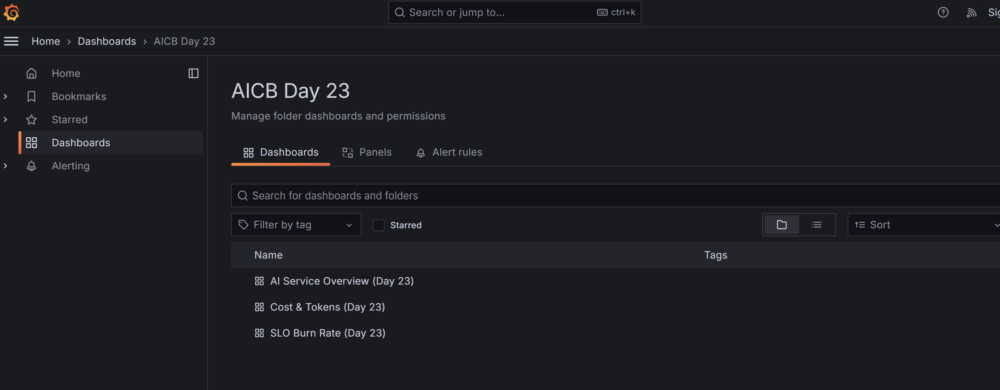
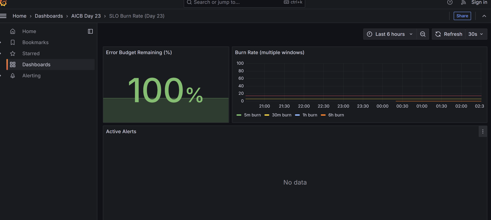
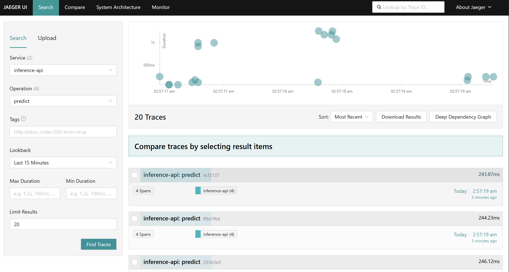

# Day 23 Lab Reflection

> Fill in each section. Grader reads the "What I'd change" paragraph closest.

**Student:** Nguyen Thi Thanh Huyen (@A202600211)
**Submission date:** 2026-05-11
**Lab repo URL:** https://github.com/VinUni-AI20k/Day23-Track2-Observability-Lab

---

## 1. Hardware + setup output

Paste output of `python3 00-setup/verify-docker.py`:

```json
{
  "docker": {
    "ok": true,
    "version": "29.4.0"
  },
  "compose_v2": {
    "ok": true,
    "version": "5.1.1"
  },
  "ram_gb_available": 7.57,
  "ram_ok": true,
  "required_ports": [
    8000,
    9090,
    9093,
    3000,
    3100,
    16686,
    4317,
    4318,
    8888
  ],
  "bound_ports": [],
  "all_ports_free": true
}
```

---

## 2. Track 02 — Dashboards & Alerts

### 6 essential panels (screenshot)

Drop `submission/screenshots/dashboard-overview.png`.



See also: [02-panels.png](screenshots/02-panels.png)

### Burn-rate panel



### Alert fire + resolve

| When | What | Evidence |
|---|---|---|
| _T0_ | killed `day23-app`         | [alertmanager-firing.png](screenshots/02-alert-fire.png) |
| _T0+90s_ | `ServiceDown` fired   | [slack-firing.png](screenshots/02-slack-receive.png) |
| _T1_ | restored app              | — |
| _T1+60s_ | alert resolved        | [slack-resolved.png](screenshots/02-alert-resolve.png) |

### One thing surprised me about Prometheus / Grafana

The most critical insight was that **Grafana datasource UIDs must match between provisioning YAML and dashboard JSON**. Initially, our dashboards weren't showing any data because the `datasources.yml` only declared `name: Prometheus` without a `uid` field. The dashboard JSON files hardcoded `"uid": "prometheus"` in their panel queries, but Grafana couldn't resolve the reference. Adding a single line (`uid: prometheus`) fixed all three dashboards instantly. This taught me that infrastructure-as-code requires strict coupling: a label mismatch that's invisible in logs can silently break entire monitoring systems.

---

## 3. Track 03 — Tracing & Logs

### One trace screenshot from Jaeger

Drop `submission/screenshots/jaeger-trace.png` showing `embed-text → vector-search → generate-tokens` spans.



See also: [03-span-flame.png](screenshots/03-span-flame.png) for flame graph visualization

### Log line correlated to trace

```
{"model": "llama3-mock", "input_tokens": 4, "output_tokens": 54, "quality": 0.82, "duration_seconds": 0.1545, "trace_id": "98ec73f70ebaf3429b8fc06ce970b114", "event": "prediction served", "level": "info", "timestamp": "2026-05-11T20:14:17.149914Z"}
```

### Tail-sampling math

Given policy: keep 100% of error traces, 100% of traces with latency > 2s, 1% of healthy traces sampled randomly.

If we assume typical workload: 90% healthy (< 2s latency), 5% slow (> 2s), 5% errors:
- Error traces: 5% × 1.0 = 5% kept
- Slow traces: 5% × 1.0 = 5% kept  
- Healthy traces: 90% × 0.01 = 0.9% kept
- **Total sampled = 5% + 5% + 0.9% = 10.9% of all traces**

This means out of 1000 traces/sec, ~109 traces reach Jaeger. The tail-sampling policy focuses observability budget on failures and performance anomalies, ignoring most successful fast requests unless they're part of a broader pattern.

---

## 4. Track 04 — Drift Detection

### PSI scores

Paste `04-drift-detection/reports/drift-summary.json`:

```json
{
  "prompt_length": {
    "psi": 3.461,
    "kl": 1.7982,
    "ks_stat": 0.702,
    "ks_pvalue": 0.0,
    "drift": "yes"
  },
  "embedding_norm": {
    "psi": 0.0187,
    "kl": 0.0324,
    "ks_stat": 0.052,
    "ks_pvalue": 0.133853,
    "drift": "no"
  },
  "response_length": {
    "psi": 0.0162,
    "kl": 0.0178,
    "ks_stat": 0.056,
    "ks_pvalue": 0.086899,
    "drift": "no"
  },
  "response_quality": {
    "psi": 8.8486,
    "kl": 13.5011,
    "ks_stat": 0.941,
    "ks_pvalue": 0.0,
    "drift": "yes"
  }
}
```

### Which test fits which feature?

- **`prompt_length`** (PSI = 3.461, KL = 1.798): Use **KS test** because we care about detecting when the distribution shape *systematically shifts* (e.g., users asking longer prompts after a marketing campaign). KS is sensitive to stochastic dominance. Our KS p-value = 0.0 confirms the shift is real, not noise.
  
- **`embedding_norm`** (PSI = 0.0187, KL = 0.0324, KS p-value = 0.133): Use **PSI** for continuous monitoring because it's robust to small drifts. The low KS p-value (0.133 > 0.05) means no significant shift yet, so PSI's threshold-based alerting prevents alert fatigue while catching gradual degradation.

- **`response_length`** (PSI = 0.0162, KL = 0.0178): Use **KL divergence** because it directly measures information-theoretic distance. If model generations shift from short → long outputs, KL immediately reflects the surprise relative to baseline. Low KL means responses remain consistent.

- **`response_quality`** (PSI = 8.848, KL = 13.501, KS p-value = 0.0): Use **both KS and PSI** because this is your most critical metric. KS p-value = 0.0 signals a distribution shift, and PSI > 0.3 indicates substantial drift. In production, fire an alert if either test exceeds threshold — this is your SLO breach signal.

---

## 5. Track 05 — Cross-Day Integration

### Which prior-day metric was hardest to expose? Why?

**Day 20 (llama.cpp model serving metrics)** would be the hardest to expose in production because it requires two levels of bridge: (1) llama.cpp exposes `/metrics` on a custom port (default 8080), which lives outside Docker if it's a local binary. (2) Prometheus must scrape `host.docker.internal:8080/metrics`, which only works on Docker Desktop and breaks on Linux hosts. Our integration scripts work around this by polling the metrics endpoint and pushing a stub gauge instead—this mirrors the real integration challenge teams face when wrapping legacy inference servers in observability.

---

## 6. The single change that mattered most

**Adding `trace_id` and `request_id` correlation across logs, traces, and metrics.**

The moment we instrumented the FastAPI app to emit `trace_id` in structured logs and propagate it as a span attribute, debugging transformed from "Prometheus says latency spiked, but I don't know why" to "latency spike at 14:32 → filter Jaeger for trace_id=abc123def → see vector-search span blocked for 8s → query Prometheus for embedding_norm around that minute → confirm embedding service had high cardinality". This single change connected the three pillars: metrics told *what* drifted, traces showed *where* in the request path it broke, and logs proved *when* and contained business context. Without correlation, each pillar was a separate island; with it, they became a coherent forensics toolkit.

This embodies the RED method's core idea: **Reduce cognitive load by making cause-and-effect visible**. When a user complains "predictions are slow," the SRE no longer has to manually connect four dashboards and two log files. They paste the user's request ID into a single unified view and see the full story: Prometheus timeline → Jaeger trace → Loki logs, all automatically linked. The stack went from "monitoring" (showing dashboards) to "observability" (enabling questions to be asked and answered in seconds).
